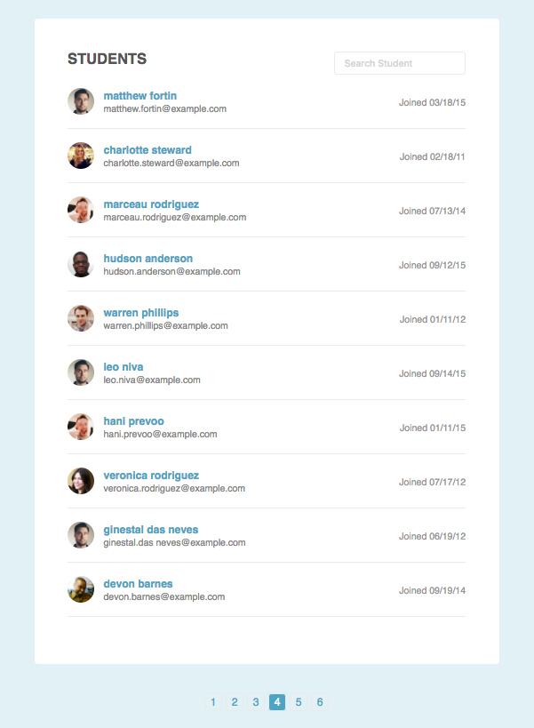

# Pagination and Content Filter

## Introduction

In this project, an HTML page and CSS files was given and I have to add a search and pagination feature using unobstrusive javascript. The resulting page is a page that display at most 10 student entries with an instant student search capabilities.

## Usage

### Demo pages

You can see the demo page [here](https://wahidyankf.github.io/pagination-and-content-filter/).

### Result

The result can be seen in the gh-pages branch of this repository.

### The Source

The source of this app can be seen in the src folder of master branch. 

## Testing

This app was tested using [HTML](https://validator.w3.org/) and [CSS](https://jigsaw.w3.org/css-validator/) validator.

## Sreenshots

## License

[MIT](https://en.wikipedia.org/wiki/MIT_License).